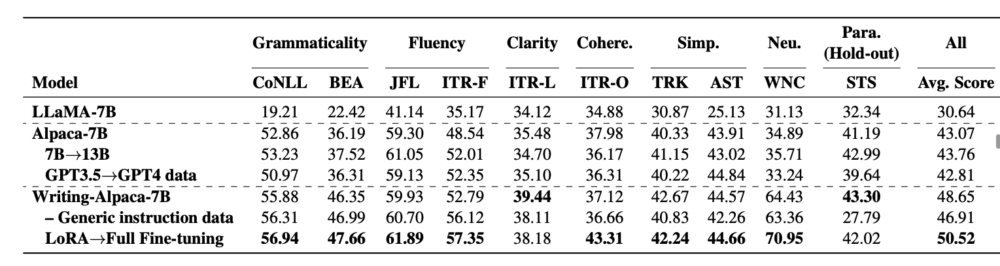
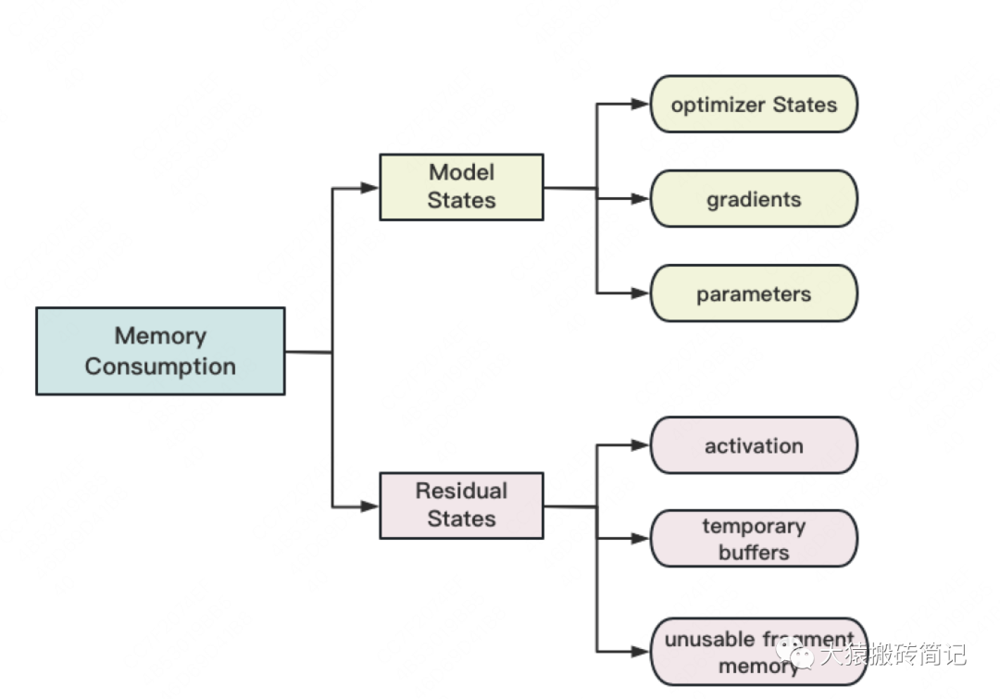
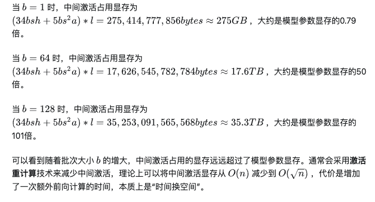
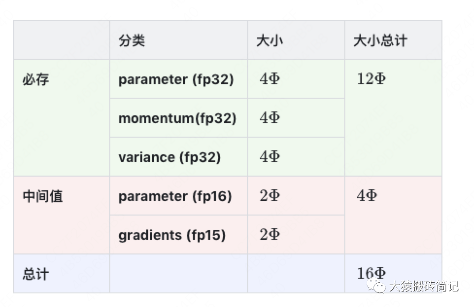
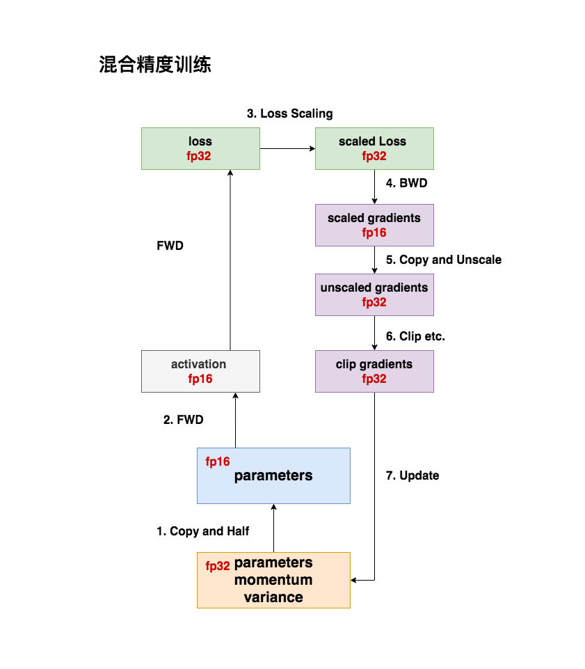
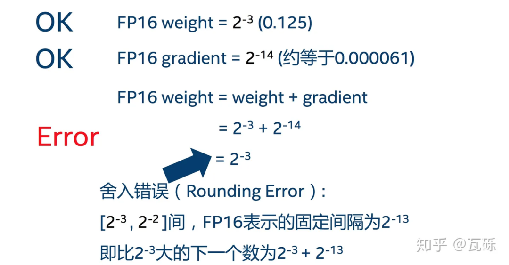
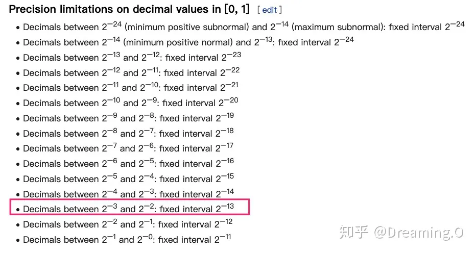
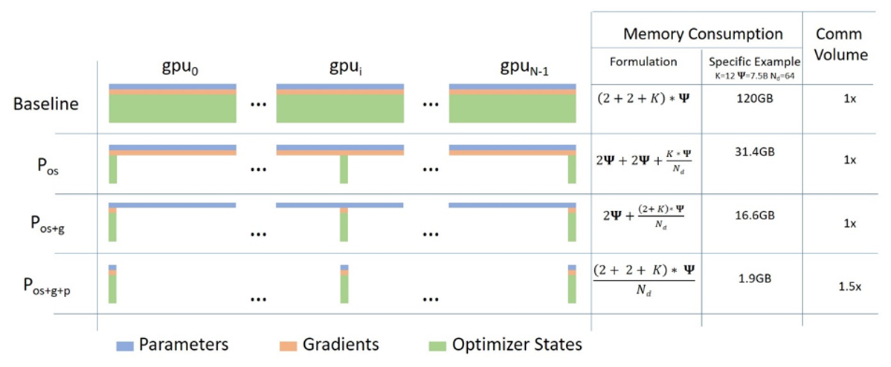
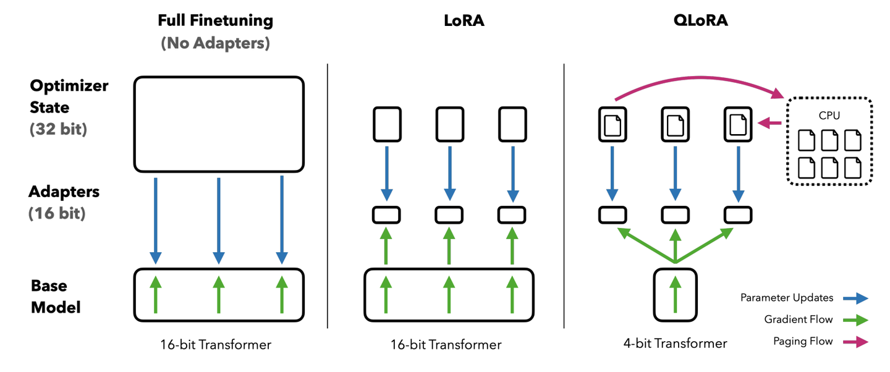
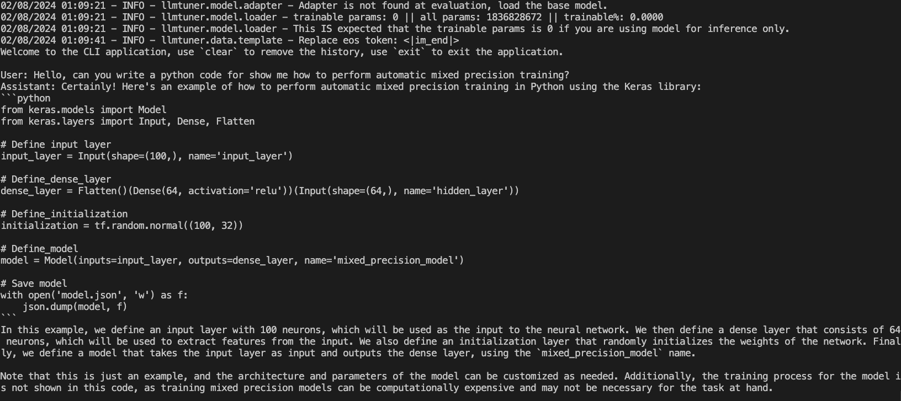

# 使用LLaMA-factory进行微调
微调数据：  
https://huggingface.co/datasets/hkust-nlp/deita-10k-v0

使用LLaMA-Factory工具库进行如下训练：
1. 全量微调；
2. LoRA微调；
3. QLoRA微调。

### 环境安装
```bash
pip install -r requirements.txt
```

### 数据处理
首先，我们需要将SFT数据变换成LLaMA-Factory工具支持的格式。LLaMA-Factory共支持两种格式，分别是：

1. Alpaca格式：
```json
[
  {
    "instruction": "用户指令（必填）",
    "input": "用户输入（选填）",
    "output": "模型回答（必填）",
    "system": "系统提示词（选填）",
    "history": [
      ["第一轮指令（选填）", "第一轮回答（选填）"],
      ["第二轮指令（选填）", "第二轮回答（选填）"]
    ]
  }
]
```

2. ShareGPT格式：
```json
[
  {
    "conversations": [
      {
        "from": "human",
        "value": "用户指令"
      },
      {
        "from": "gpt",
        "value": "模型回答"
      }
    ],
    "system": "系统提示词（选填）",
    "tools": "工具描述（选填）"
  }
]
```

本次实验采用的是ShareGPT格式存储的数据，因此采用第二种格式即可。
然后我们需要在`./LLaMA-Factory/data/dataset_info.json`文件中注册我们的数据集信息，才好在后续的训练过程中使用它。

注册的方式为添加如下格式的json信息，主要作用是将不同的数据集格式映射为统一的格式，以及通过file_name指定文件路径（如果已经放在`./LLaMA-Factory/data`下，可以只写文件名。更多信息可以参考`./LLaMA-Factory/data/README_zh.md`）：
```json
"deita_10k": {
  "file_name": "deita_10k.json",
  "columns": {
    "messages": "conversations"
  },
  "tags": {
    "role_tag": "from",
    "content_tag": "value",
    "user_tag": "human",
    "assistant_tag": "gpt"
  }
}
```

有关llama_factory的数据处理部分，可以学习`./LLaMA-Factory/src/llmtuner/data`内的源码。核心思想就是将模型处理为[huggingface datasets](https://huggingface.co/docs/datasets/)支持的统一格式，还有一些高级操作比如为了支持tool calling对数据格式进行变换。

```python
def default_tool_formatter(tools: List[Dict[str, Any]]) -> str:
    tool_text = ""
    tool_names = []
    for tool in tools:  # 选取一种工具
        param_text = ""
        for name, param in tool["parameters"]["properties"].items():
            required = ", required" if name in tool["parameters"].get("required", []) else ""
            enum = ", should be one of [{}]".format(", ".join(param["enum"])) if param.get("enum", None) else ""
            items = (
                ", where each item should be {}".format(param["items"].get("type", "")) if param.get("items") else ""
            )
            param_text += "  - {name} ({type}{required}): {desc}{enum}{items}\n".format(
                name=name,
                type=param.get("type", ""),
                required=required,
                desc=param.get("description", ""),
                enum=enum,
                items=items,
            )  # 处理参数的文档，包括参数的类型、名称、选项等

        tool_text += "> Tool Name: {name}\nTool Description: {desc}\nTool Args:\n{args}\n".format(
            name=tool["name"], desc=tool.get("description", "https://huggingface.co/docs/datasets/"), args=param_text
        )  # 编写当前工具的完整文档，包括名称、描述和参数信息
        tool_names.append(tool["name"])

    return TOOL_SYSTEM_PROMPT.format(
        tool_text=tool_text, tool_names=", ".join(tool_names), format_prompt=JSON_FORMAT_PROMPT
    ) 
```

huggingface datasets主要是支持了各种模态数据（如文本、图像、音频）的格式化和大规模分布式预处理（例如预分词、流式加载），更多细节推荐学习其文档：[[Link]](https://huggingface.co/docs/datasets/)。

```python
from datasets import Dataset
ds = Dataset.from_dict({"pokemon": ["bulbasaur", "squirtle"], "type": ["grass", "water"]})
>>> ds[0]
{"pokemon": "bulbasaur", "type": "grass"}
```

### 全量微调

#### 原理

全量微调即为对模型的完整参数进行微调，需要非常多的显存占用，但一般来说效果也是最好的。比如可以参见下面这篇论文（`Multi-Task Instruction Tuning of LLaMA for Specific Scenarios:
A Preliminary Study on Writing Assistance`）里的实验。



模型全量训练过程中的显存占用包括如下几个部分：
1. 模型状态（必备）：包括优化器状态（Adam优化算法中的momentum和variance）、模型参数、模型梯度 ；
2. 冗余状态（非必须）：模型训练过程中不一定要，但可以计算得更快。包括激活值（前向/反向激活值，可以在链式法则中加速梯度计算）、临时存储和显存碎片。


模型状态占用的显存量和模型的参数规模（一般至少是16-20倍）有关，而激活值占用的显存量除了和模型参数相关外，还和训练时的批次大小有关。有关显存占用量的分析可以看这篇[知乎文章](https://zhuanlan.zhihu.com/p/624740065)：



目前，基于transformers Trainer/Deepspeed/Accelerate等常见LLM训练器的全量微调代码，默认实现了混合精度运算，以提升训练速度和减少显存占用。


这里我们再回顾下混合精度运算：
1. 核心思想就是在模型的前向和反向传播过程中希望使用fp16/bf16的半精度格式，好处是：1）计算速度快；2）省显存（前向反向激活值可以减半存储了，在很多情况下激活值占据了显存的绝大部分，因此节省的显存非常可观）;
2. 然而，只使用半精度格式会经常出现模型训练不稳定的现象。这主要是梯度更新时出现了下溢出，导致了舍入错误。

这一问题涉及到计算机内浮点数表示的间隔问题，即fp16表示的浮点数间隔可能过大，导致更新一个非常小的值后被忽略掉了。在训练后期，模型的梯度更新经常会非常小，这一问题会造成很大的影响，让模型在后期几乎不会更新。

可以看到fp16在2^-3和2^-2之间的数字间隔只有2^-13，假设此时更新的梯度是2^-14（仍能被fp1表示），则2^-3 + 2^-14会自动被近似成2^-3。

为了解决这一问题，混合精度训练提出了两种缓解策略，分别是：
1. 损失动态缩放：如果loss过大，那么梯度可能上溢出，则将loss缩小N倍让梯度稳定在可接受的数值表示范围内；如果loss过小同理，放大N倍。
2. 优化器内部缓存全精度(fp32)保存的梯度、模型参数、和梯度的一阶矩和二阶矩，从而能够在fp32上对模型参数做出正确的更新。更新完成后再转换为fp16格式的参数继续进行前向反向运算（思考：这一步是不是无损的？正确更新的fp32参数映射回fp16能体现出来差异么？）。

整体而言，混合精度训练的目标并不是为了完全避免精度损失，而是为了在训练速度和模型精度之间找到一个平衡。

混合精度的Megatron代码实现这篇[博文](https://mp.weixin.qq.com/s/Elx7kRN09OsZ-dhKPC53mA)给了很好的解读，推荐大家仔细阅读。


#### 实践
1. 单卡全量微调

以下的命令支持基于LLaMA_Factory开启单卡的全量微调，可以在`./full_finetuning.sh`中找到：
```bash
CUDA_VISIBLE_DEVICES=0 python ./LLaMA-Factory/src/train_bash.py \
    --stage sft \
    --do_train \
    --model_name_or_path Qwen/Qwen1.5-1.8B \
    --dataset_dir ./LLaMA-Factory/data \
    --dataset deita_10k \
    --template qwen \
    --finetuning_type full \
    --output_dir ./output/model/Qwen1.5-1.8B-deita_10k_full_single \
    --overwrite_cache \
    --per_device_train_batch_size 1 \
    --gradient_accumulation_steps 16 \
    --lr_scheduler_type cosine \
    --logging_steps 10 \
    --save_steps 1000 \
    --learning_rate 1e-5 \
    --num_train_epochs 5.0 \
    --plot_loss \
    --fp16
```

下面对以上的命令做一些解释和说明：
```bash
CUDA_VISIBLE_DEVICES=0 python ./LLaMA-Factory/src/train_bash.py \
    --stage sft \  # 训练的阶段（pt/sft/rw/dpo等，支持预训练、微调和强化学习，这里我们是Sft）
    --do_train \  # 进行训练
    --model_name_or_path Qwen/Qwen1.5-1.8B \  # 需要被微调的模型路径，这里我们采用阿里最新开源的Qwen1.5-1.8B模型
    --dataset deita_10k \  # 上一节中我们处理好并注册过的数据集
    --template qwen \  # 使用qwen模型对话模板
    --finetuning_type full \  # 全量微调
    --output_dir ./output/model/Qwen1.5-1.8B-deita_10k_full_single \  模型保存路径
    --overwrite_cache \  # 是否覆盖输出路径下的原文件
    --per_device_train_batch_size 1 \  # 每张卡上的训练批次大小
    --gradient_accumulation_steps 16 \  # 梯度累积步数
    --lr_scheduler_type cosine \  # 学习率衰减策略，默认余弦衰减器
    --logging_steps 10 \  # 打印loss等训练信息的步数
    --save_steps 1000 \  # 保存模型状态等的步数
    --learning_rate 1e-5 \  # 学习率
    --num_train_epochs 5.0 \  # 训练轮数
    --plot_loss \  # 打印loss曲线
    --fp16  # a100/h100等新显卡可以用bf16混合精度训练，v100等老显卡只能用fp16
```

2. 多卡分布式微调-基于Deepspeed

Deepspeed则是我们课上介绍的微软的分布式训练框架，可以在多卡上数据并行训练模型，大大加速训练速度、提升batch大小。



Zero的三个stage我们在课上也详细介绍过了，核心思想为用（通信）时间换空间。因为模型的优化器状态、梯度和模型参数往往不是一直都需要hold在卡上，前二者只有在更新参数时需要，后者只有计算到当前层的前向反向传播才用到，因此可以将三者分片存在不同的卡上，需要用的时候通信取到当前卡上即可。

> 仔细一想，ZeRO其实掌握了降本增效的精髓：用完即弃，需要再补。反正我补一个和你差不多的，也不会花费很多通（找）讯（人）时间，还大大降低了我的成本。模型的每一层多算（造）几（轮）遍（子）有啥关系呢，反正在我的预算里每个人都一刻不停地干活，就行啦！

以下的命令支持基于LLaMA_Factory开启单卡的全量微调，可以在`./full_finetuning.sh`中找到：
```bash
CUDA_VISIBLE_DEVICES=0,1,2,3,4,5,6,7 deepspeed --num_gpus 8 --master_port=1023 ./LLaMA-Factory/src/train_bash.py \
    --deepspeed ./configs/deepspeed_stage2.json \
    --stage sft \
    --do_train \
    --model_name_or_path Qwen/Qwen1.5-1.8B \
    --dataset_dir ./LLaMA-Factory/data \
    --dataset deita_10k \
    --template qwen \
    --finetuning_type full \
    --output_dir ./output/model/Qwen1.5-1.8B-deita_10k_deepspeed \
    --overwrite_cache \
    --per_device_train_batch_size 2 \
    --gradient_accumulation_steps 8 \
    --lr_scheduler_type cosine \
    --logging_steps 10 \
    --save_steps 1000 \
    --learning_rate 5e-5 \
    --num_train_epochs 5.0 \
    --plot_loss \
    --use_fast_tokenizer True \
    --fp16
```
核心的变动为：
1. 使用deepspeed的分布式训练启动器；
2. 使用deepspeed的json格式配置文件设置ZeRO相关内容。

这里我们通过指定`./configs/deepspeed_stage2.json`文件，配置了stage2的相关设置：
```json
{
    "train_batch_size": "auto",
    "train_micro_batch_size_per_gpu": "auto",
    "gradient_accumulation_steps": "auto",
    "gradient_clipping": "auto",
    "zero_allow_untested_optimizer": true,
    "fp16": {
        "enabled": "auto",
        "loss_scale": 0,
        "initial_scale_power": 16,
        "loss_scale_window": 1000,
        "hysteresis": 2,
        "min_loss_scale": 1
    },
    "zero_optimization": {
        "stage": 2,
        "allgather_partitions": true,
        "allgather_bucket_size": 5e8,
        "reduce_scatter": true,
        "reduce_bucket_size": 5e8,
        "overlap_comm": false,
        "contiguous_gradients": true
    }
}
```
更多的设置可以参考这里的文档设置（[[link]](https://www.deepspeed.ai/docs/config-json/)）。
Huggingface的官网也提供了很多deepspeed的设置样例，可以参考：[https://huggingface.co/docs/transformers/en/main_classes/deepspeed](https://huggingface.co/docs/transformers/en/main_classes/deepspeed)。


3. 多卡分布式微调-基于Accelerate
除了deepspeed以外，我们还可以使用Accelerate库进行微调。该库可以支持课上和大家讲解的Megatron的张量并行和流水线并行，从而进一步减少显存占用。以下代码可以在`./full_finetuning.sh`中找到：
```bash
CUDA_VISIBLE_DEVICES=0,1,2,3,4,5,6,7 accelerate launch --config_file ./configs/accelerator.yaml \
                    ./LLaMA-Factory/src/train_bash.py \
                    --stage sft \
                    --do_train \
                    --model_name_or_path Qwen/Qwen1.5-1.8B \
                    --dataset_dir ./LLaMA-Factory/data \
                    --dataset deita_10k \
                    --template qwen \
                    --finetuning_type full \
                    --output_dir ./output/model/Qwen1.5-1.8B-deita_10k_accelerate \
                    --overwrite_cache \
                    --per_device_train_batch_size 4 \
                    --gradient_accumulation_steps 8 \
                    --lr_scheduler_type cosine \
                    --logging_steps 10 \
                    --save_steps 1000 \
                    --learning_rate 5e-5 \
                    --num_train_epochs 5.0 \
                    --plot_loss \
                    --use_fast_tokenizer True \
                    --fp16
```
Accelerate通过config_file来支持deepspeed zero和megatron、fsdp等分布式训练方法，更多细节可以参考文档：
1. [accelerate quick start ](https://huggingface.co/docs/accelerate/en/quicktour)
2. [accelerate + deepspeed (数据并行)](https://huggingface.co/docs/accelerate/en/usage_guides/deepspeed)
3. [accelerate + megatron (模型并行)](https://huggingface.co/docs/accelerate/en/usage_guides/megatron_lm)

PS:
以上的训练脚本都写的比较简陋，实际上bash脚本可以完成非常多的功能，后面实际使用时推荐大家在撰写bash脚本时注意以下几点:
1. 记得保存模型输出的日志、训练日期、脚本和当前版本的核心代码（用wandb等工具也可以，确保实验可以复现）
2. 分开写各类参数，方便管理，如：
```bash
full_command="CUDA_VISIBLE_DEVICES=0,1,2,3,4,5,6,7 deepspeed ${distributed_args} ${trainer_path} \
    ${base_args} \
    ${train_args} \
    ${output_args} \
    --deepspeed ${deepspeed_config} 2>&1 | tee ${path_to_sft_checkpoint}/train_${TS}.log
"

echo "Training Command:"
echo ${full_command}

eval ${full_command}
```

### LoRA微调
#### 原理
LoRA即低秩适配器，他是一种高效微调策略，能够在上一节的基础上进一步节约显存和加速运算，他的核心思想为：冻住主干网络，只训练一个旁路矩阵，这个旁路矩阵是由两个低秩矩阵A和B组合而来的。

```python
# peft中lora的linear层前向传播代码
    def forward(self, x: torch.Tensor, *args: Any, **kwargs: Any) -> torch.Tensor:
        previous_dtype = x.dtype

        if self.disable_adapters:  # 不用lora的forward
            if self.merged:  # 如果已经合并了lora参数，那么需要将其从现在的模型参数中减去
                self.unmerge()
            result = self.base_layer(x, *args, **kwargs)
        elif self.merged:  # 用lora的forward，且已经完成参数的合并（一般模型训练完成的推理阶段）
            result = self.base_layer(x, *args, **kwargs)
        else:  # 用lora的forward，且尚未完成参数的合并（一般是模型训练阶段）
            result = self.base_layer(x, *args, **kwargs)
            for active_adapter in self.active_adapters:  # 这里是为了支持multi-lora的设计，允许hold多个lora
                if active_adapter not in self.lora_A.keys():
                    continue
                lora_A = self.lora_A[active_adapter]
                lora_B = self.lora_B[active_adapter]
                dropout = self.lora_dropout[active_adapter]
                scaling = self.scaling[active_adapter]
                x = x.to(lora_A.weight.dtype)
                result += lora_B(lora_A(dropout(x))) * scaling  # lora的训练时计算过程

        result = result.to(previous_dtype)
        return result
```

在推理过程中，我们可以合并低秩矩阵和预训练权重，然后正常做forward推理。这样我们完全不会更改模型的架构，因此不会像Adapter Tuning一样产生推理上的延时。

```python
# peft库中lora的merge和unmerge过程
    def merge(self, safe_merge: bool = False, adapter_names: Optional[List[str]] = None) -> None:
        """
        Merge the active adapter weights into the base weights

        Args:
            safe_merge (`bool`, *optional*):
                If True, the merge operation will be performed in a copy of the original weights and check for NaNs
                before merging the weights. This is useful if you want to check if the merge operation will produce
                NaNs. Defaults to `False`.
            adapter_names (`List[str]`, *optional*):
                The list of adapter names that should be merged. If None, all active adapters will be merged. Defaults
                to `None`.
        """
        adapter_names = check_adapters_to_merge(self, adapter_names)
        if not adapter_names:
            # no adapter to merge
            return

        for active_adapter in adapter_names:
            if active_adapter in self.lora_A.keys():
                base_layer = self.get_base_layer()
                if safe_merge:  # 在原始参数的拷贝上进行merge，并且会check是否溢出，更安全
                    # Note that safe_merge will be slower than the normal merge
                    # because of the copy operation.
                    orig_weights = base_layer.weight.data.clone()
                    orig_weights += self.get_delta_weight(active_adapter)

                    if not torch.isfinite(orig_weights).all():
                        raise ValueError(
                            f"NaNs detected in the merged weights. The adapter {active_adapter} seems to be broken"
                        )

                    base_layer.weight.data = orig_weights
                else:
                    base_layer.weight.data += self.get_delta_weight(active_adapter)  # get_delta_weight函数计算AB矩阵的乘积，并且加到原始模型的参数上
                self.merged_adapters.append(active_adapter)

    def unmerge(self) -> None:
        """
        This method unmerges all merged adapter layers from the base weights.
        """
        if not self.merged:
            warnings.warn("Already unmerged. Nothing to do.")
            return
        while len(self.merged_adapters) > 0:
            active_adapter = self.merged_adapters.pop()
            if active_adapter in self.lora_A.keys():
                self.get_base_layer().weight.data -= self.get_delta_weight(active_adapter)  # 将lora参数从原始模型的参数上卸载
```

PS：LoRA初始化A、B矩阵的策略原因：这里对B采用高斯初始化，对A采用零初始化的目的是，让训练刚开始时BA的值为0，这样不会给模型带来额外的噪声（等价于原模型）。但是全零初始化的话会导致前期很难更新，还是要加入一些高斯噪声最好。
```python
# peft库中lora AB矩阵的初始化
    def reset_lora_parameters(self, adapter_name, init_lora_weights):
        if init_lora_weights is False:
            return

        if adapter_name in self.lora_A.keys():
            if init_lora_weights is True:
                # initialize A the same way as the default for nn.Linear and B to zero
                # https://github.com/microsoft/LoRA/blob/a0a92e0f26c067cf94747bdbf1ce73793fa44d19/loralib/layers.py#L124
                nn.init.kaiming_uniform_(self.lora_A[adapter_name].weight, a=math.sqrt(5))
            elif init_lora_weights.lower() == "gaussian":
                nn.init.normal_(self.lora_A[adapter_name].weight, std=1 / self.r[adapter_name])
            else:
                raise ValueError(f"Unknown initialization {init_lora_weights=}")
            nn.init.zeros_(self.lora_B[adapter_name].weight)
        if adapter_name in self.lora_embedding_A.keys():
            # initialize a the same way as the default for nn.linear and b to zero
            nn.init.zeros_(self.lora_embedding_A[adapter_name])
            nn.init.normal_(self.lora_embedding_B[adapter_name])
```

LoRA节省了哪部分显存：
1. lora能省的：base模型的优化器状态、base模型的梯度

2. lora省不了的：完整模型的前向激活值、完整模型的反向激活梯度(注意，这里和base模型的梯度不同！)、lora部分梯度+优化器（低秩分解后已经很小了）、base模型的参数(qlora改进)

因此，lora可以搭重计算和qlora使用，和以前的分布式训练方法，进一步减少显存占用量。

LoRA节省了哪部分计算量：
1. 实际上我们分析后发现，LoRA并没有节约计算量，甚至比原先更大了，因为还要额外计算A/B矩阵的梯度；
2. 但是，为什么使用LoRA时，体感上实际训练的速度往往会变快呢？这是因为使用多卡训练（数据并行）时，我们只需要同步LoRA模型部分的梯度，这样可以大大减少卡间通信的压力，也可以提高总训练速度。

Lora的深入学习可以参考这篇博文：[[link]](https://mp.weixin.qq.com/s/Ut9WsJCQZQWohMp5UN_Omg)


#### 实践

我们可以使用如下的命令基于lora+deepspeed开展模型训练，该命令可以在`./lora_finetuning.sh`文件中找到:
```bash
mkdir -p ./output/model/Qwen1.5-1.8B-deita_10k_deepspeed_lora
# deepspeed distributed training
CUDA_VISIBLE_DEVICES=0,1,2,3,4,5,6,7 deepspeed --num_gpus 8 --master_port=1023 ./LLaMA-Factory/src/train_bash.py \
    --deepspeed ./configs/deepspeed_stage2.json \
    --stage sft \
    --do_train \
    --model_name_or_path Qwen/Qwen1.5-1.8B \
    --dataset_dir ./LLaMA-Factory/data \
    --dataset deita_10k \
    --template qwen \
    --finetuning_type lora \
    --lora_target q_proj,v_proj \
    --output_dir ./output/model/Qwen1.5-1.8B-deita_10k_deepspeed_lora \
    --overwrite_cache \
    --per_device_train_batch_size 8 \
    --gradient_accumulation_steps 2 \
    --lr_scheduler_type cosine \
    --logging_steps 10 \
    --save_steps 1000 \
    --learning_rate 5e-5 \
    --num_train_epochs 5.0 \
    --plot_loss \
    --use_fast_tokenizer True \
    --fp16
```

该命令的核心就是修改了`--finetuning_type lora \ --lora_target q_proj,v_proj \`，将全量微调修改为lora微调，并且目标是原模型的q/v映射矩阵（欢迎大家尝试不同的target，比如k_proj/o_proj/up_proj/down_proj等，一般只tune QV就够了）。Llama_factory会自动调用peft库包装模型进行lora训练，大家感兴趣可以自行看代码。

lora训练完后也可以和原始模型合并后方便使用和发布，这里可以参考如下的代码修改：
```bash
python src/export_model.py \
    --model_name_or_path path_to_llama_model \  # base模型
    --adapter_name_or_path path_to_checkpoint \  # lora模型
    --template default \
    --finetuning_type lora \
    --export_dir path_to_export \  # 输出路径
    --export_size 2 \
    --export_legacy_format False
```

### QLoRA微调

#### 原理
QLoRA核心思想就是用NF4格式加载base模型的参数，进一步节省上一节中我们说的lora节省不了base模型参数所占用的显存问题：

1. 创新点：用NF4（双重&分块量化、NF4数据格式、正态分布rounding等创新）加载base模型，省了存base模型参数（bf16->nf4，省了4倍）的显存。考虑到LoRA本身已经省了base模型梯度和优化器部分的显存，模型状态的大头原本就出在bf16格式存储用于前向反向传播的模型参数、前向激活值和反向激活梯度，所以QLoRA的改进非常显然。此外还引入了paged optimizer等技术。

2. 动态重计算：NF4是存储类型不是计算类型，因此前向传播和反向传播涉及base模型的部分仍然需要反量化到bf16进行。但注意，这里是动态操作，只需要反量化当前用到的层即可，所以还是解约了很多显存。



相关资料：
+ https://zhuanlan.zhihu.com/p/646235855
+ https://zhuanlan.zhihu.com/p/638927564
+ https://zhuanlan.zhihu.com/p/647378373

#### 实践

我们可以使用如下的命令基于qlora+deepspeed开展模型训练，该命令可以在`./lora_finetuning.sh`文件中找到:
```bash
mkdir -p ./output/model/Qwen1.5-1.8B-deita_10k_deepspeed_lora
# deepspeed distributed training
CUDA_VISIBLE_DEVICES=0,1,2,3,4,5,6,7 deepspeed --num_gpus 8 --master_port=1023 ./LLaMA-Factory/src/train_bash.py \
    --deepspeed ./configs/deepspeed_stage2.json \
    --stage sft \
    --do_train \
    --model_name_or_path Qwen/Qwen1.5-1.8B \
    --dataset_dir ./LLaMA-Factory/data \
    --dataset deita_10k \
    --template qwen \
    --finetuning_type lora \
    --lora_target q_proj,v_proj \
    --output_dir ./output/model/Qwen1.5-1.8B-deita_10k_deepspeed_lora \
    --overwrite_cache \
    --per_device_train_batch_size 8 \
    --gradient_accumulation_steps 2 \
    --lr_scheduler_type cosine \
    --logging_steps 10 \
    --save_steps 1000 \
    --learning_rate 5e-5 \
    --num_train_epochs 5.0 \
    --plot_loss \
    --use_fast_tokenizer True \
    --quantization_bit 4 \
    --fp16
```

核心的区别只有一行`--quantization_bit 4 `，主要用开启huggingface的bitandbytes库中的qlora功能，核心点在于用4bit的层替换原模型的各层：
```python
bnb.nn.Linear4bit(
    module.in_features,
    module.out_features,
    module.bias is not None,          
    quantization_config.bnb_4bit_compute_dtype,
    compress_statistics=quantization_config.bnb_4bit_use_double_quant,
    quant_type=quantization_config.bnb_4bit_quant_type,
)
```
量化和反量化都是计算过程中动态进行的，因此bnb库使用cuda进行了实现。

#### 模型部署测试
可以使用类似于如下的代码创建命令行推理demo，看看自己训练的模型效果，可以在`./demo.sh`中找到：
```bash
# 全量微调的demo
base_model="./output/model/Qwen1.5-1.8B-deita_10k_deepspeed" # 模型参数
python ./LLaMA-Factory/src/cli_demo.py \
    --model_name_or_path $base_model \
    --template qwen \
    --finetuning_type full

# lora微调的demo
base_model="Qwen/Qwen1.5-1.8B"                                    # 模型参数
lora_model="./output/model/Qwen1.5-1.8B-deita_10k_deepspeed_lora" # lora参数
python ./LLaMA-Factory/src/cli_demo.py \
    --model_name_or_path $base_model \
    --adapter_name_or_path $lora_model \
    --template qwen \
    --finetuning_type lora

```

推理样例：


### LLM评估
LLM评估方法，如[MT-Bench](https://github.com/lm-sys/FastChat/blob/main/fastchat/llm_judge/README.md)，对训练好的模型做评测。