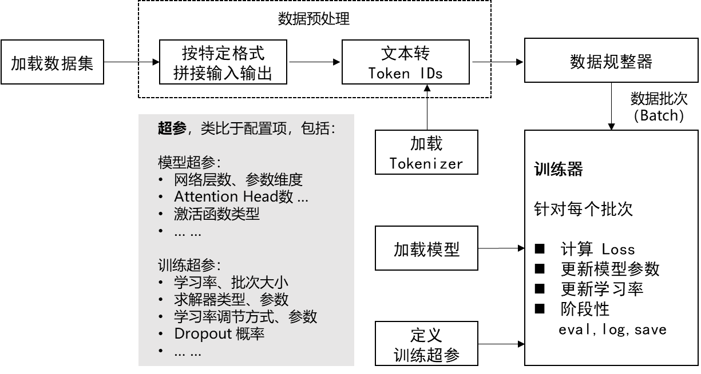

# 情感分类微调
## 数据
- 输入：电影评论
- 输出：标签 ['neg','pos']
- 数据源：https://huggingface.co/datasets/rotten_tomatoes
## 微调流程

1. 加载数据
2. 模型加载
3. 数据预处理（特定格式输入输出，文本转token ID）
4. 数据规整器（batch，padding）
5. 模型训练
6. 模型评估

## 注
- 可以使用tensorboard查看训练过程
    - tensorboard --logdir output/
- 可以使用wandb查看训练过程
